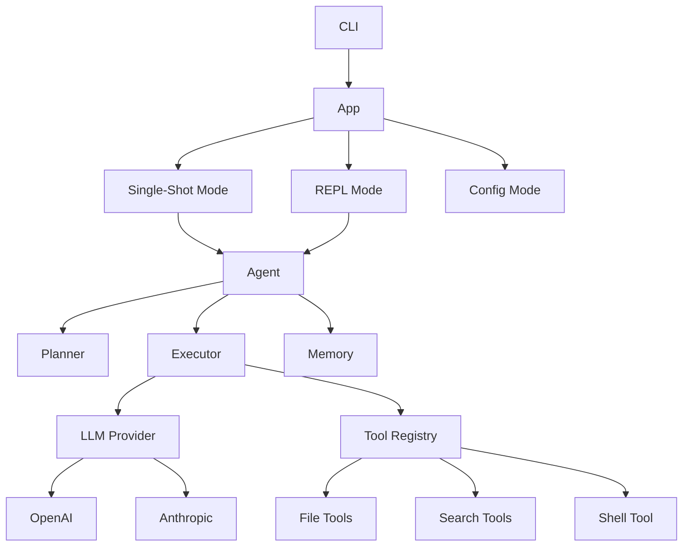

# LCode

> 🤖 **LCode** — A powerful Rust-based CLI code agent for autonomous software development.

LCode is an AI-powered coding assistant that operates directly in your terminal. It can understand your codebase, plan complex development tasks, and execute them by reading, writing, searching files, and running shell commands — all under your supervision.

[](https://rust-lang.org)
[](LICENSE)

## ✨ Features

- **🧠 LLM-Powered**: Supports OpenAI (GPT-4, GPT-4o) and Anthropic (Claude 3.5/4) as backends
- **🛠️ Rich Tool Set**: Read/write/edit files, grep code, glob patterns, execute shell commands
- **✅ Safety First**: Configurable command allow/deny lists, user approval for tool calls, timeout protection
- **💬 Interactive REPL**: Full-featured terminal interface with history, auto-complete, and slash commands
- **⚡ Single-Shot Mode**: Run one-shot tasks directly: `lcode run "Add unit tests for auth"`
- **⚙️ Flexible Config**: TOML config files (global + per-project), environment variables, CLI overrides
- **🪶 Lightweight**: Fast Rust binary with minimal dependencies

## 🚀 Quick Start

### Prerequisites

- Rust 1.80+ (install via [rustup](https://rustup.rs))
- An API key from [Anthropic](https://console.anthropic.com) or [OpenAI](https://platform.openai.com)

### Installation

```bash
# Clone the repository
git clone https://github.com/Lixiang9716/LCode.git
cd LCode

# Build and install
cargo install --path .

# Or run directly
cargo run --release
```

### Configuration

```bash
# Set your LLM provider and API key
lcode config set llm.provider anthropic
lcode config set llm.api-key sk-ant-...
lcode config set llm.model claude-sonnet-4-20250514

# Or use environment variables
export LCODE_LLM_PROVIDER=anthropic
export LCODE_LLM_API_KEY=sk-ant-...
```

### Usage

```bash
# Interactive mode
lcode

# Single-shot task
lcode run "Refactor the error handling in src/auth.rs"

# Run with auto-approve (use with caution!)
lcode run -y "Fix all clippy warnings"

# Show configuration
lcode config show
```

## 📁 Project Structure

```
LCode/
├── src/
│   ├── main.rs              # Entry point
│   ├── cli.rs               # CLI argument parsing
│   ├── app.rs               # Application orchestration
│   ├── agent/               # Agent core
│   │   ├── mod.rs           # Agent module + provider factory
│   │   ├── planner.rs       # Task planning & decomposition
│   │   ├── executor.rs      # Agent loop execution
│   │   └── memory.rs        # Conversation memory management
│   ├── llm/                 # LLM provider abstraction
│   │   ├── mod.rs           # Common types (ChatMessage, ToolDefinition, etc.)
│   │   ├── provider.rs      # LlmProvider trait
│   │   ├── openai.rs        # OpenAI / OpenAI-compatible provider
│   │   └── anthropic.rs     # Anthropic Claude provider
│   ├── tools/               # Agent tools
│   │   ├── mod.rs           # Tool trait + registry
│   │   ├── file.rs          # read_file, write_file, edit_file, list_dir
│   │   ├── search.rs        # grep (content search), glob (file pattern)
│   │   └── shell.rs         # Shell command execution
│   ├── config/              # Configuration management
│   │   └── mod.rs           # Config loading, merging, env overrides
│   ├── repl/                # Interactive REPL
│   │   └── mod.rs           # Terminal interface with rustyline
│   └── utils/               # Shared utilities
│       └── mod.rs           # Error types
├── tests/                   # Integration tests
├── Cargo.toml
└── README.md
```

## 🏗️ Architecture



## 🛠️ Built-in Tools

| Tool | Description |
|------|-------------|
| `read_file` | Read file contents with line numbers |
| `write_file` | Create or overwrite a file |
| `edit_file` | Find-and-replace in files |
| `list_dir` | List directory contents |
| `grep` | Search file contents with regex |
| `glob` | Find files by pattern |
| `shell` | Execute shell commands |

## 🔒 Safety Features

- **Tool Approval**: By default, every tool call requires user confirmation
- **Command Filtering**: Dangerous commands (`rm -rf /`, `sudo`, `mkfs`) are blocked
- **Timeout Protection**: Shell commands timeout after 120 seconds
- **Allow/Deny Lists**: Customize which commands are permitted

## 📝 Configuration Reference

Configuration is loaded from (in order of precedence):
1. Command-line arguments
2. Environment variables (`LCODE_` prefix)
3. Project-local `.lcode.toml`
4. User-global `~/.config/lcode/config.toml`

See `lcode config list` for all available settings.

## 🧪 Development

```bash
# Run tests
cargo test

# Run with debug logging
RUST_LOG=lcode=debug cargo run

# Build release
cargo build --release
```

## 🗺️ Roadmap

- [x] Core agent loop with planning and execution
- [x] Multi-provider LLM support (OpenAI + Anthropic)
- [x] File operations, code search, shell execution
- [x] Interactive REPL with history
- [x] Configuration management
- [ ] Streaming LLM responses
- [ ] Multi-step task decomposition with LLM
- [ ] Session save/restore
- [ ] VS Code extension
- [ ] MCP (Model Context Protocol) integration
- [ ] Web dashboard

## 📄 License

MIT © [Lixiang9716](https://github.com/Lixiang9716)
