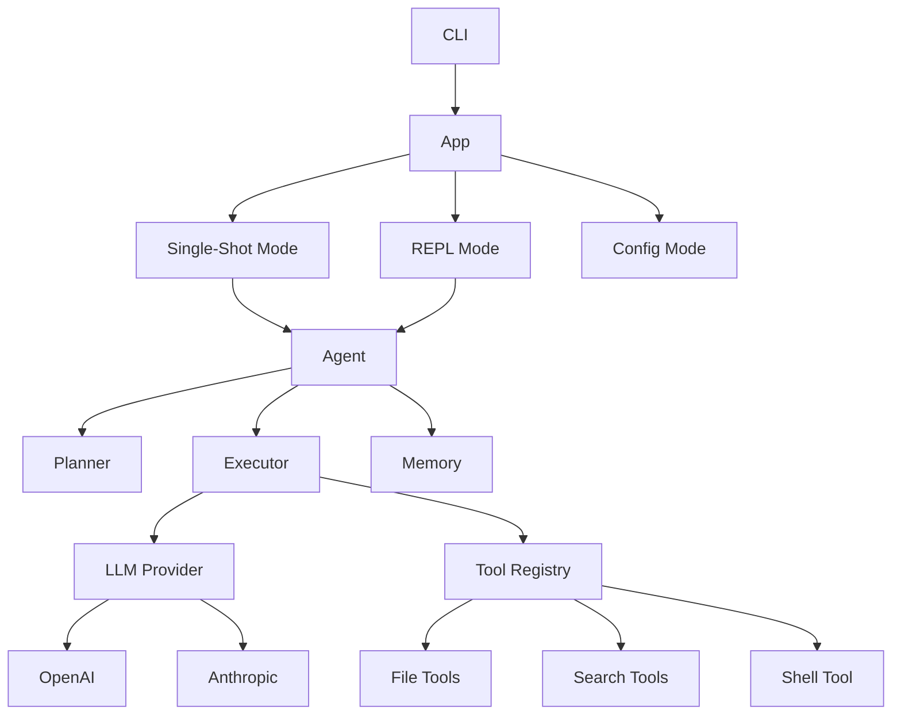

# LCode

> 🤖 **LCode** — A powerful Rust-based CLI code agent for autonomous software development.

LCode is an AI-powered coding assistant that operates directly in your terminal. It can understand your codebase, plan complex development tasks, and execute them by reading, writing, searching files, and running shell commands — all under your supervision.

[](https://rust-lang.org)
[](LICENSE)

## ✨ Features

- **🧠 LLM-Powered**: Supports OpenAI (GPT-4, GPT-4o) and Anthropic (Claude 3.5/4) as backends
- **🛠️ Rich Tool Set**: Read/write/edit files, grep code, glob patterns, execute shell commands
- **✅ Safety First**: Configurable command allow/deny lists, user approval for tool calls, timeout protection
- **💬 Interactive REPL**: Full-featured terminal interface with history, auto-complete, and slash commands
- **⚡ Single-Shot Mode**: Run one-shot tasks directly: `lcode run "Add unit tests for auth"`
- **⚙️ Flexible Config**: TOML config files (global + per-project), environment variables, CLI overrides
- **🪶 Lightweight**: Fast Rust binary with minimal dependencies

## 🚀 Quick Start

### Prerequisites

- Rust 1.94+ (install via [rustup](https://rustup.rs))
- An API key from [Anthropic](https://console.anthropic.com) or [OpenAI](https://platform.openai.com)

### Installation

```bash
# Clone the repository
git clone https://github.com/Lixiang9716/LCode.git
cd LCode

# Build and install
cargo install --path .

# Or run directly
cargo run --release
```

### Configuration

```bash
# Set your LLM provider and API key
lcode config set llm.provider anthropic
lcode config set llm.api-key sk-ant-...
lcode config set llm.model claude-sonnet-4-20250514

# Or use environment variables
export LCODE_LLM_PROVIDER=anthropic
export LCODE_LLM_API_KEY=sk-ant-...
```

### Usage

```bash
# Interactive mode
lcode

# Single-shot task
lcode run "Refactor the error handling in src/auth.rs"

# Run with auto-approve (use with caution!)
lcode run -y "Fix all clippy warnings"

# Show configuration
lcode config show
```

## 📁 Project Structure

```
LCode/
├── src/
│   ├── main.rs              # Entry point
│   ├── cli.rs               # CLI argument parsing
│   ├── app.rs               # Application orchestration
│   ├── agent/               # Agent core
│   │   ├── mod.rs           # Agent module + provider factory
│   │   ├── planner.rs       # Task planning & decomposition
│   │   ├── executor.rs      # Agent loop execution
│   │   └── memory.rs        # Conversation memory management
│   ├── llm/                 # LLM provider abstraction
│   │   ├── mod.rs           # Common types (ChatMessage, ToolDefinition, etc.)
│   │   ├── provider.rs      # LlmProvider trait
│   │   ├── openai.rs        # OpenAI / OpenAI-compatible provider
│   │   └── anthropic.rs     # Anthropic Claude provider
│   ├── tools/               # Agent tools
│   │   ├── mod.rs           # Tool trait + registry
│   │   ├── file.rs          # read_file, write_file, edit_file, list_dir
│   │   ├── search.rs        # grep (content search), glob (file pattern)
│   │   └── shell.rs         # Shell command execution
│   ├── config/              # Configuration management
│   │   └── mod.rs           # Config loading, merging, env overrides
│   ├── repl/                # Interactive REPL
│   │   └── mod.rs           # Terminal interface with rustyline
│   └── utils/               # Shared utilities
│       └── mod.rs           # Error types
├── tests/                   # Integration tests
├── Cargo.toml
└── README.md
```

## 🏗️ Architecture



## 🛠️ Built-in Tools

| Tool | Description |
|------|-------------|
| `read_file` | Read file contents with line numbers |
| `write_file` | Create or overwrite a file |
| `edit_file` | Find-and-replace in files |
| `list_dir` | List directory contents |
| `grep` | Search file contents with regex |
| `glob` | Find files by pattern |
| `shell` | Execute shell commands |

## 🔒 Safety Features

- **Tool Approval**: By default, every tool call requires user confirmation
- **Command Filtering**: Dangerous commands (`rm -rf /`, `sudo`, `mkfs`) are blocked
- **Timeout Protection**: Shell commands timeout after 120 seconds
- **Allow/Deny Lists**: Customize which commands are permitted

## 📝 Configuration Reference

Configuration is loaded from (in order of precedence):
1. Command-line arguments
2. Environment variables (`LCODE_` prefix)
3. Project-local `.lcode.toml`
4. User-global `~/.config/lcode/config.toml`

See `lcode config list` for all available settings.

### Runtime tuning (`config.toml`)

Every previously hardcoded runtime parameter is configurable. The
defaults match the pre-configuration behavior; a full example:

```toml
[llm]
provider = "deepseek"          # openai / anthropic / deepseek / kimi / minimax / glm
api_key = "sk-..."
model = "deepseek-v4-flash"    # 旧名 deepseek-chat/reasoner 已退役（仍可用，映射到 flash）
max_tokens = 8192
temperature = 0.3
fallback_model = ""            # optional failover model
thinking_disabled = false      # true: skip DeepSeek v4's hidden reasoning
                               # tokens (~79 fewer prompt tokens, faster)
reasoning_effort = "high"      # "low" / "high" / "max"（thinking 开启时生效）
                               # low 实测省 ~65% 推理 token、~50% 延迟，正确率无损失
internal_thinking_disabled = true
                               # true（默认）: 内部工具调用（压缩摘要、记忆提取/合并）
                               # 强制关闭思考——同任务实测 48 vs 531 tokens

[agent]
system_prompt = "You are LCode, an expert software engineer..."
max_turns = 100
require_approval = true
context_size = 128000
skills_dir = "skills"          # optional; defaults to <workspace>/skills
todo_nag_after_turns = 3       # turns without a todo update before the reminder

[compaction]
auto_threshold = 50000         # token budget before auto-compact
keep_recent = 3                # recent messages kept verbatim by micro-compaction
summary_tail_chars = 80000     # conversation tail fed to the summarizer
min_len = 100                  # skip compaction below this history length

[team]
work_turns = 50                # max LLM turns per teammate WORK phase
idle_interval_secs = 5         # seconds between IDLE polls
idle_polls = 12                # empty polls before auto-shutdown

[subagent]
max_turns = 30
max_tool_result_chars = 50000

[memory]
consolidate_threshold = 10     # files before consolidation kicks in
max_relevant = 5               # memories injected into the system prompt
max_extract_chars = 4000       # dialogue characters fed to extraction
json_lock = false              # true: 用 beta 前缀续写强制记忆提取以 `[` 开头
                               # 的 JSON 回复（需 openai_compatible + api.deepseek.com）

[background]
default_timeout_secs = 300
max_result_chars = 50000

[retry]
max_attempts = 5
base_delay_ms = 500
max_delay_ms = 30000

[events]
channel_capacity = 256         # broadcast event buffer
command_capacity = 64          # command channel buffer

[todo]
max_items = 20

[tools]
allowed_dirs = []
allowed_commands = []
denied_commands = ["rm -rf /", "sudo", "chmod 777", "mkfs"]
enable_web = true              # deepseek 端点自动启用服务端 web_search 工具
```

Each value can also be overridden per invocation via its `LCODE_*`
environment variable, e.g. `LCODE_TEAM_IDLE_INTERVAL_SECS=2 lcode run ...`.
See `src/config/mod.rs` (`apply_env_overrides`) for the full key list.

### DeepSeek 调优建议

实测（[`docs/deepseek-api-report.md`](docs/deepseek-api-report.md)）得出的配置建议：

- **上下文预算**：flash 有 1M 上下文，默认 50K 压缩阈值只用了 5%。日常任务可上调到
  `compaction.auto_threshold = 150000`~`250000`，减少压缩次数并让 KV cache 命中更多轮。
  消息顺序已经"稳定前缀在前"（system + 工具 schema + 记忆 + 变化尾巴），是缓存友好的
  布局，不要打乱。
- **推理档位**：机械性任务（改测试、格式化、查错）用 `reasoning_effort = "low"`；
  架构设计/重构用默认 `high` 或 `max`。内部调用（压缩/记忆）默认已强制关思考。
- **联网检索**：`deepseek` 端点（Anthropic 兼容）自动暴露服务端 `web_search` 工具，
  由 API 执行搜索并回传结果，无需本地工具；`tools.enable_web = false` 关闭。
- **JSON 锁定**：`memory.json_lock = true` 时记忆提取走 beta 前缀续写端点
  （`https://api.deepseek.com/beta/chat/completions`），模型被迫以 `[` 开头，
  无法前置废话，JSON 解析更可靠；需要 `provider = "openai_compatible"` +
  `api_base = "https://api.deepseek.com"`。

## 📊 Token Usage & Cost

每次会话结束后 CLI 打印用量摘要（`📊 Tokens: ...`），并在事件日志中记录 `UsageSummary`
事件（prompt / completion / cache-hit / reasoning tokens + 预估美元成本，按 DeepSeek
官方定价表：flash $0.14 输入、$0.0028 缓存命中、$0.28 输出 / 每 1M；pro 档自动识别）。
缓存命中可显著降低长上下文会话成本。

## 🔬 DeepSeek API Report

[`docs/deepseek-api-report.md`](docs/deepseek-api-report.md) — 对 DeepSeek API 的全面实测报告：
7 维度约 100 次真实请求（参数矩阵 / 流式 / thinking / function calling / 缓存 / 双模型 / 错误路径），
含 4 个 major 行为发现（默认思考模式、旧模型名降级、错误结构不统一、缓存匹配语义）与 LCode 集成结论。

## 🧪 Development

```bash
# Run tests
cargo test

# Run with debug logging
RUST_LOG=lcode=debug cargo run

# Build release
cargo build --release
```

## 🗺️ Roadmap

- [x] Core agent loop with planning and execution
- [x] Multi-provider LLM support (OpenAI + Anthropic)
- [x] File operations, code search, shell execution
- [x] Interactive REPL with history
- [x] Configuration management
- [ ] Streaming LLM responses
- [ ] Multi-step task decomposition with LLM
- [ ] Session save/restore
- [ ] VS Code extension
- [ ] MCP (Model Context Protocol) integration
- [ ] Web dashboard

## 📄 License

MIT © [Lixiang9716](https://github.com/Lixiang9716)
